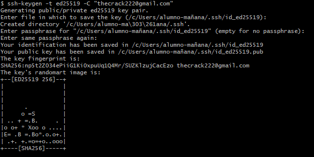
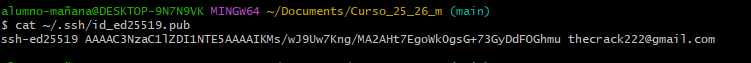
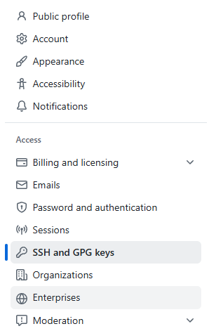
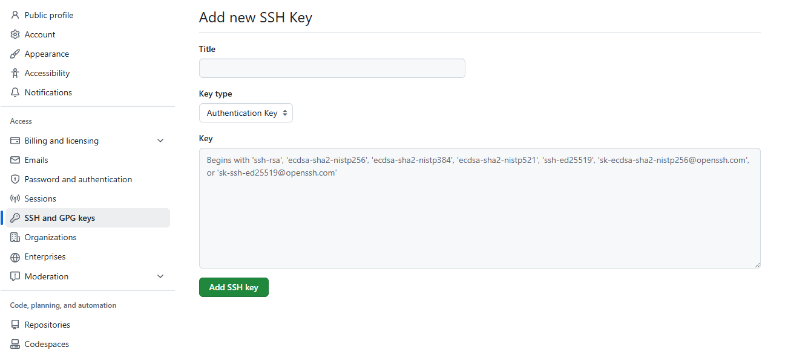
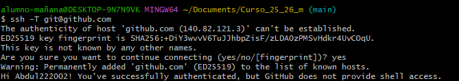

# Manual configurar GitHub por SSH

## Instalación de la clave en GitHub

1. *Generar una clave SSH en tu ordenador con el siguiente comando:*
   
   ```bash
   ssh-keygen -t ed25519 -C "thecrack222@gmail.com"
   ```

   Esto creará una clave pública y privada en la ruta predeterminada.

   

2. *Mostrar la clave para verificar que se ha creado correctamente:*  
   
   ```bash
   cat ~/.ssh/id_ed25519.pub
   ```

   

3. *Copiar el contenido de la **clave pública** y pegarlo en GitHub:*  
   
   - Ajustes → SSH and GPG keys → Nueva clave SSH

   <p align="center">
     
   </p>

   

4. *Añadir un título descriptivo para identificar la clave (por ejemplo "PC Personal").*

---

## Añadir la clave al Agent

1. *Abrir **PowerShell** como administrador e iniciar el servicio **ssh-agent**:*
   ```powershell
   Get-Service ssh-agent | Set-Service -StartupType Automatic
   Start-Service ssh-agent
   ```

   
   

2. *Añadir la clave privada al agente:*  
   ```bash
   ssh-add ~/.ssh/id_ed25519
   ```

   Esto permite usar la clave automáticamente sin tener que introducirla cada vez.

---

## Verificar la clave

1. *Probar la conexión con GitHub:*
   ```bash
   ssh -T git@github.com
   ```

   Resultado esperado:
   ```
   Hi Abdul222002! You've successfully authenticated, but GitHub does not provide shell access.
   ```

   

2. *Opcional: comprobar que la clave pública se encuentra registrada en GitHub y que el ssh-agent tiene la clave cargada.*

---

## Cambiar repositorio de HTTPS a SSH

1. *Si tu repositorio local está configurado con HTTPS, cambiarlo a SSH:*  
   ```bash
   git remote set-url origin git@github.com:Abdul222002/Curso_25_26_m.git
   ```

2. *Verificar que se ha cambiado correctamente:*  
   ```bash
   git remote -v
   ```

   Deberías ver:
   ```
   origin  git@github.com:Abdul222002/Curso_25_26_m.git (fetch)
   origin  git@github.com:Abdul222002/Curso_25_26_m.git (push)
   ```

---

## Comprobación final

- Puedes hacer un `git pull` o `git push` y no te pedirá usuario ni contraseña:
  ```bash
  git pull origin main
  git push origin main
  ```

---

## Notas y recomendaciones

- Nunca compartas tu clave privada (`id_ed25519`).
- Puedes usar múltiples claves SSH si trabajas en diferentes cuentas o proyectos.
- Si ves `Permission denied (publickey)`, revisa que tu clave esté añadida al agente y registrada en GitHub.
- El archivo `~/.ssh/known_hosts` guarda servidores de confianza; la primera vez que te conectas te pedirá confirmar la autenticidad del host.

